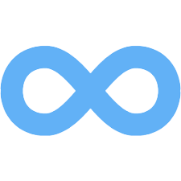

<!--

*** To avoid retyping too much info. Do a search and replace for the following:
*** vishal1995srinivas, Infinity, twitter_handle, vishal1995srinivas
-->


<!-- PROJECT SHIELDS -->
<!--
*** I'm using markdown "reference style" links for readability.
*** Reference links are enclosed in brackets [ ] instead of parentheses ( ).
*** See the bottom of this document for the declaration of the reference variables
*** for contributors-url, forks-url, etc. This is an optional, concise syntax you may use.
*** https://www.markdownguide.org/basic-syntax/#reference-style-links
-->
<!-- [![Contributors][contributors-shield]][contributors-url] -->
<!-- [![Forks][forks-shield]][forks-url] -->
<!-- [![Stargazers][stars-shield]][stars-url]-->
[![Issues][issues-shield]][issues-url] 
[![MIT License][license-shield]][license-url]
<!-- [![LinkedIn][linkedin-shield]][linkedin-url] -->


<!-- PROJECT LOGO -->
<br />
<p align="center">
  <a href="https://github.com/vishal1995srinivas/Infinity">
    
  </a>

  <h3 align="center">INFINITY</h3>

  <p align="center">
    Inspired from POSTMAN
    <br />
    <a href="https://github.com/vishal1995srinivas/Infinity"><strong>Explore the docs »</strong></a>
    <br />
    <br />
    <a href="https://infinity-darkmode.herokuapp.com/.com">View Demo</a>
    ·
    <a href="https://github.com/vishal1995srinivas/Infinity/issues">Infinity Bug</a>
    ·
    <a href="https://github.com/vishal1995srinivas/Infinity/issues">Request Feature</a>
  </p>
</p>


<!-- TABLE OF CONTENTS -->
## Table of Contents

* [About the Project](#about-the-project)
  * [Built With](#built-with)
* [Getting Started](#getting-started)
  * [Prerequisites](#prerequisites)
  * [Installation](#installation)
* [Usage](#usage)
* [Roadmap](#roadmap)
* [Contributing](#contributing)
* [License](#license)
* [Contact](#contact)
<!-- ABOUT THE PROJECT -->
## About The Project

[![Product Name Screen Shot][product-screenshot]](https://example.com)

Thanks for checking out my first MERN App Infinity. Infinity helps API development easy. Manage and test your API's at one place in one go. This is just a basic version and a lot more to come soon.
Tutorial on development is coming soon.

Infinity is inspired from [Postman](https://www.postman.com/). 


### Built With

* [MongoDB](http://mongodb.com/)
* [ExpressJS](https://expressjs.com/)
* [ReactJS](https://reactjs.org/)
* [NodeJS](https://nodejs.org/en/)

<!-- GETTING STARTED -->
## Getting Started

To get a local copy up and running follow these simple steps.

### Prerequisites

Following steps lead you to run the app in your local system.
* npm
```sh
npm install npm@latest -g
```

### Installation
 
1. Clone the Infinity
```sh
git clone https://github.com/vishal1995srinivas/Infinity.git
```
2. Install NPM packages
```sh
npm install
```
2. Install Mongo and start the Mongo server
```sh
mongod --dbpath ./mongodb --port 27018 && mongo
```
3. Start the server
```sh
nodemon server.js
```
4. Install NPM packages inside client
```sh
cd client && npm install
```
5. Start the client
```sh
npm start
```


<!-- USAGE EXAMPLES -->

<!-- ROADMAP -->
## Roadmap

See the [open issues](https://github.com/vishal1995srinivas/Infinity/issues) for a list of proposed features (and known issues).

<!-- CONTRIBUTING -->
## Contributing

Thanks for checking out this App. If you have a suggestion that would
make this better, please fork the Infinity and create a pull request or simply open
an issue with the tag "enhancement".

Thanks again! Now go create something AMAZING! 😃.
Any contributions you make are **greatly appreciated**.

<!-- LICENSE -->
## License

Distributed under the MIT License. See `LICENSE` for more information.


<!-- CONTACT -->
## Contact


Project Link: [https://github.com/vishal1995srinivas/Infinity](https://github.com/vishal1995srinivas/Infinity)


<!-- MARKDOWN LINKS & IMAGES -->
<!-- https://www.markdownguide.org/basic-syntax/#reference-style-links -->
[contributors-shield]: https://img.shields.io/github/contributors/othneildrew/Best-README-Template.svg?style=flat-square
[contributors-url]: https://github.com/othneildrew/Best-README-Template/graphs/contributors
[forks-shield]: https://img.shields.io/github/forks/othneildrew/Best-README-Template.svg?style=flat-square
[forks-url]: https://github.com/othneildrew/Best-README-Template/network/members
[stars-shield]: https://img.shields.io/github/stars/othneildrew/Best-README-Template.svg?style=flat-square
[stars-url]: https://github.com/othneildrew/Best-README-Template/stargazers
[issues-shield]: https://img.shields.io/github/issues/othneildrew/Best-README-Template.svg?style=flat-square
[issues-url]: https://github.com/vishal1995srinivas/Infinity/issues
[license-shield]: https://img.shields.io/github/license/othneildrew/Best-README-Template.svg?style=flat-square
[license-url]: https://github.com/othneildrew/Best-README-Template/blob/master/LICENSE.txt
[linkedin-shield]: https://img.shields.io/badge/-LinkedIn-black.svg?style=flat-square&logo=linkedin&colorB=555
[linkedin-url]: https://linkedin.com/in/othneildrew
[product-screenshot]: images/scrnsht.png
